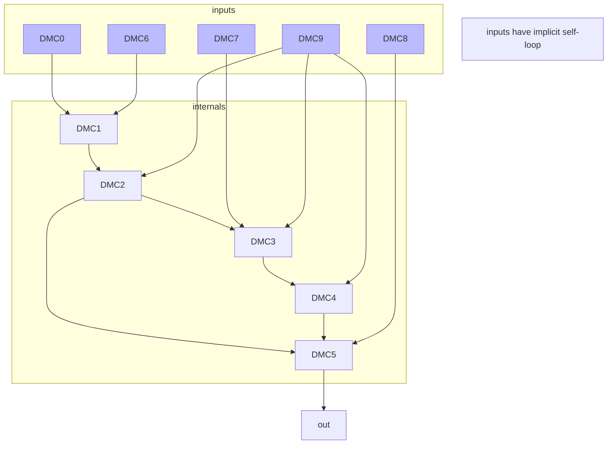

```mermaid
flowchart TD
  0["DMC0"] --> 1
  1["DMC1"] --> 2
  2["DMC2"] --> 3
  2["DMC2"] --> 5
  3["DMC3"] --> 4
  4["DMC4"] --> 5
  5["DMC5"] --> out
  6["DMC6"] --> 1
  7["DMC7"] --> 3
  8["DMC8"] --> 5
  9["DMC9"] --> 2
  9["DMC9"] --> 3
  9["DMC9"] --> 4
subgraph inputs
   0:::inStyle
   6:::inStyle
   7:::inStyle
   8:::inStyle
   9:::inStyle
end
subgraph internals
  0
  1
  2
  3
  4
  5
  6
  7
  8
  9
end
classDef inStyle fill:#bbf
text["inputs have implicit self-loop"]
```