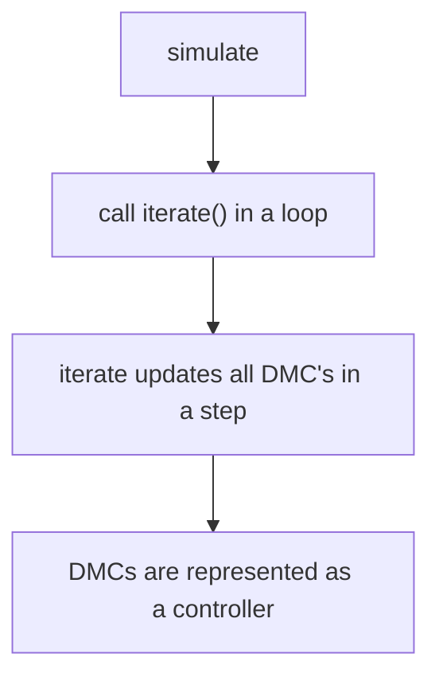

# proc-control

### program flow

### dmc.py
A class to describe a DMC controller. Parameters are function name, goal, constraints, and a parameter list. 

Call update() to "run" the DMC for a single step. Output is a list of temp, pressure, or whatever is being simulated. 

### structure.py
A class to iterate the DMCs for each step. Parameter is the list of:
* DMC name
* List of connected DMCs
* DMC parameters
* **input** for the respective DMC

`iterate()` uses the connection list and outputs the final plant output. 

Aaaaaaah
